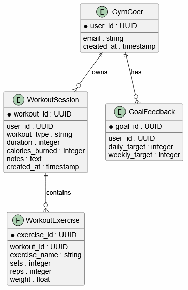

=== 2.3 Implementation
==== Overview

===== Scope

[.added]#This section describes the implementation in terms of the domain model. It states which domain concepts, functions, and behaviors are realized, how they relate to the requirements in Section 2.2, and where the current implementation reaches its boundaries. Source code details and storage technology specifics are kept in Section 2.3.1, which provides the implementation evidence.#

===== [.added]#Relation to the Domain Model#

[.added]#The implementation realizes the following domain concepts from Section 2.1.2:#

[.added]#*Workout Session* is realized as a persistent record that a GymGoer creates by performing `recordWorkout`. Each Workout Session carries a Calendar Day, a Duration, an Activity type, optional Exercises, and optional Workout Notes. Workout Sessions are owned by the GymGoer who created them; they are not shared between GymGoers and they are not accessible except through that GymGoer's WorkoutHistory.#

[.changed]#*Workout History* is realized conceptually as the ordered collection of all Workout Sessions belonging to one GymGoer. The current source code still exposes this retrieval through the implementation-specific adapter `getUserWorkoutSessions(userId)`, which returns stored session records. In the domain model, that adapter corresponds to `retrieveWorkoutHistory(gymGoer) -> WorkoutHistory`; the implementation should be refactored so application code speaks in terms of `WorkoutHistory` rather than raw storage records. The home dashboard, the history view, and the feedback components derive their visible behavior from the retrieved sessions.#

[.added]#*Attendance Day*, *Goal Evaluation*, *Weekly Summary*, and *Streak* are not stored separately. They are computed from the WorkoutHistory each time they are needed. This matches the domain modeling choice in Section 2.1.6, where `computeStreak`, `evaluateWeeklyGoal`, `evaluateConsistency`, and `generateWeeklySummary` all take a WorkoutHistory as input and produce derived results.#

[.changed]#*GymGoer identity*: the current implementation uses a persistent account identifier as the surrogate for the GymGoer entity. All WorkoutHistory retrieval, Goal storage, and Streak computation is scoped to that identifier. The identifier is resolved through an authentication boundary; unauthenticated requests cannot access a GymGoer's WorkoutHistory or derived values. The implementation boundary detail — the specific authentication mechanism — is documented in Section 2.3.1 and is treated as infrastructure, not as domain terminology.#

===== [.added]#Realization of the Domain Functions#

[.added]#`recordWorkout` is realized as a user-facing logging flow. The GymGoer provides the Activity type, Duration, optional Exercises, and optional WorkoutNotes. The system validates that the Duration is positive and that any numeric fields are within acceptable ranges before persisting. If Exercise details are provided and persistence of those details fails after the Workout Session itself has already been saved, the system attempts to remove the incomplete session rather than leave the WorkoutHistory in a partially-written state. The detail of how this rollback is implemented is in Section 2.3.1.#

[.added]#`updateWorkoutSession` and `deleteWorkoutSession` are realized through a history correction flow. A GymGoer can view their past Workout Sessions, select one, edit its Activity type, Duration, calories, or Workout Notes, and save the correction. Deleting a Workout Session removes it from the WorkoutHistory. Both operations cause all derived values — Streak, Goal Evaluation, Weekly Summary — to be recomputed from the updated WorkoutHistory. Section 2.3.1 documents the validation rules applied before an update is persisted.#

[.added]#`evaluateWeeklyGoal` and `generateWeeklySummary` are realized as derived display computations. The system counts the distinct Attendance Days within the current Week from the GymGoer's WorkoutHistory and compares that count to the stored Goal Target Count. The display shows how many Attendance Days were recorded and how many remain to meet the goal. The computation counts days, not sessions, consistent with the elicitation finding in Section 2.1.1 that GymGoers think in terms of showing up, not in terms of raw session count.#

[.added]#`computeStreak` is realized in two forms. The first computes the longest Streak ever recorded in the WorkoutHistory. The second computes the current active Streak, which applies stricter rules: it requires at least two consecutive Attendance Days, ignores duplicate sessions on the same Calendar Day, and returns zero if the most recent qualifying Attendance Day is older than yesterday. The active Streak also supports a grace period in which a one-day gap does not immediately break the Streak. Both forms derive their result from the WorkoutHistory; neither stores a separate Streak record. The specifics of the grace-period behavior are documented in the state machine diagram in Section 2.1.5 and in the streak tests cited in Section 3.2.#

===== [.added]#Architectural Approach#

[.added]#The implementation separates public routes from authenticated routes. Public routes handle account creation, sign-in, and password recovery. Authenticated routes require a valid GymGoer identity before rendering; any request without one is redirected to the sign-in route. This boundary ensures that WorkoutHistory, Progress, and Goal data are only accessible to the owning GymGoer.#

[.changed]#The home screen assembles the four main derived views — Streak display, weekly progress, daily goal progress, and weekly summary — from retrieved Workout Sessions that together represent the GymGoer's WorkoutHistory. When any modification is made (a new session logged, a session edited, a session deleted), the derived views recompute from the updated history. The current code still mixes this domain behavior with storage-specific calls in some components; this is documented as a clean-architecture refactor target rather than hidden as completed work.#

===== [.added]#Verification Evidence#

[.added]#The following automated checks verify the implemented domain behavior:#

[.added]#Streak computation is verified by tests that cover streak growth across consecutive Attendance Days, duplicate-session handling on the same Calendar Day, grace-period activation and expiry, and reset behavior when the Streak breaks. Goal and history computations are verified by tests that cover timestamp normalization, day counting within a date range, unique-day counting across a Week, and longest-streak calculation. The acceptance tests verify that logging a Workout Session updates the daily goal display and that the logged session appears in the WorkoutHistory view. The auth acceptance tests verify the protected-route redirect and the four account-flow paths. The specific test file names and observed results are in Section 3.2.#

===== [.added]#Current Boundaries of the Implementation#

[.added]#The logging flow records the Workout Session using the current Calendar Day as its date. Late logging of a past Workout Session — entering a session for a Calendar Day that has already passed — is not yet supported at the interface level. A GymGoer who forgot to log yesterday can edit an existing session's fields but cannot create a new session dated to a prior Calendar Day.#

[.added]#The history editor supports changing Activity type, Duration, calories, and Workout Notes on an existing session. It does not support changing the Calendar Day of an existing session or editing the Exercise rows within a session after it has been saved.#

[.added]#Goal targets can be read and used to evaluate progress. A full goal-creation and goal-update flow — where the GymGoer sets or revises their daily or weekly target through a dedicated interface — is partially implemented; the feedback components read stored targets but the complete interface for creating and changing a Goal is not yet finished.#

[.added]#Clean-architecture boundary: the current source code does not yet fully separate domain logic from infrastructure. Some feature components and domain-adjacent modules still import the Supabase client or expose storage names such as `workout_sessions` and `goals_feedback`. The required refactor is to introduce repository interfaces and domain-level functions such as `retrieveWorkoutHistory(gymGoer)` and `evaluateWeeklyGoal(history, goal, week)`, with Supabase confined to infrastructure adapters. This would make the domain layer independently testable with an in-memory repository and would align the implementation language with the terminology in Section 2.1.2 and the signatures in Section 2.1.6.#
