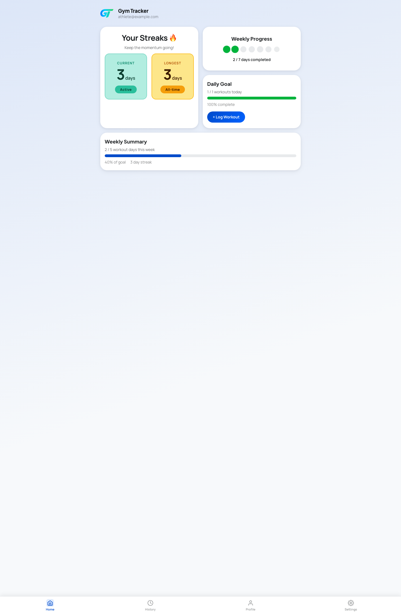
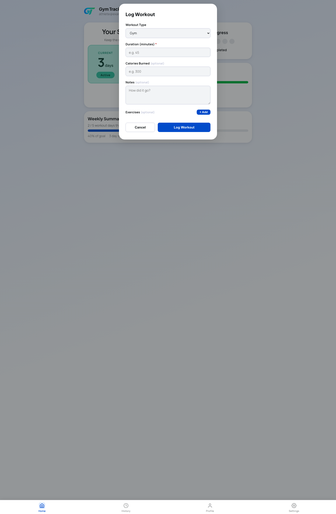
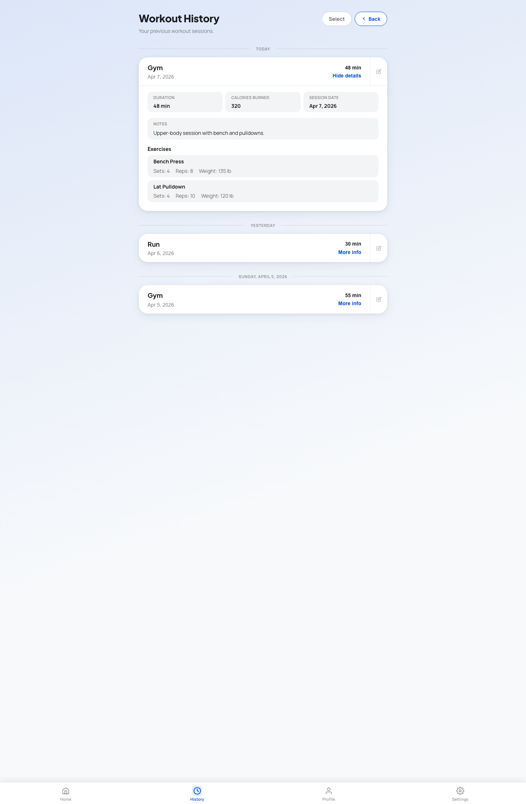

==== 2.3.1 Selected Fragments of the Implementation

#This section documents concrete implementation evidence taken from the `Development` branch. Each fragment refers to the current source files that implement the behavior.#

===== #Fragment 1: Protected routing and authentication flow#

#`src/App.tsx` places the main dashboard, workout history page, profile page, and settings page behind `ProtectedRoute`. `src/features/auth/AuthContext.tsx` loads the initial session from Supabase and subscribes to later auth state changes. `src/features/auth/ProtectedRoute.tsx` then checks that shared state. When no session exists, it redirects with `<Navigate to="/login" replace />`.#

#The public account flow is implemented in `src/features/auth/LoginPage.tsx`, `src/features/auth/SignupPage.tsx`, `src/features/auth/ForgotPasswordPage.tsx`, and `src/features/auth/ResetPasswordPage.tsx`. Those screens call the Supabase wrappers in `src/features/auth/api.ts`, namely `signInWithPassword`, `signUp`, `resetPasswordForEmail`, and `updateUser`. The branch therefore contains an implemented login, signup, password reset request, password update flow, and route protection for authenticated pages.#

===== #Fragment 2: Workout History retrieval and source data#

#`src/features/workouts/api.ts` provides `getUserWorkoutSessions(userId)` and returns the signed-in GymGoer's stored Workout Sessions in reverse chronological order. `src/App.tsx`, `src/features/feedback/DailyGoalProgress.tsx`, `src/features/feedback/WeeklyProgressSummary.tsx`, and `src/features/workouts/WorkoutHistoryPage.tsx` all consume that result as their source Workout History.#

#This retrieval path is the implemented counterpart to `retrieveWorkoutHistory : GymGoer -> WorkoutHistory` in Section 2.1.6. It also explains why the current dashboard and history views derive Attendance Days, Goal Evaluation, and Streak from stored sessions instead of from a separate derived-history table.#

===== #Fragment 3: Workout logging and rollback behavior#

#Workout logging starts in `src/features/feedback/DailyGoalProgress.tsx`, where the `+ Log Workout` button opens `src/features/workouts/LogWorkoutModal.tsx`. The modal stores workout type, duration, calories burned, notes, and optional exercise rows in component state. It rejects missing or non-positive duration values and also rejects negative calories before any write occurs.#

#Persistence is handled in `src/features/workouts/workoutSessionsApi.ts`. `createWorkoutSession(...)` retrieves the authenticated user through `supabase.auth.getUser()` and inserts `user_id`, `workout_type`, `duration_minutes`, `calories_burned`, and `notes` into `workout_sessions`. If exercise rows are present, `saveExercisesForSession(...)` upserts exercise names into `exercises` and inserts the session links into `workout_exercises`.#

#`LogWorkoutModal.tsx` also contains explicit rollback logic. If the main workout record is created but saving the linked exercises fails, the modal calls `deleteWorkoutSession(workoutId)` and reports that the workout was not logged. The current implementation therefore protects Workout History from a partial save instead of leaving a session without its intended exercise details.#

===== #Fragment 4: Workout history correction and refresh#

#`src/features/workouts/WorkoutHistoryPage.tsx` loads the signed-in user's sessions, groups them by the date portion of `created_at`, and fetches linked exercise rows when a session is expanded. The same page implements editing and deletion through `updateWorkoutSession(...)` and `deleteWorkoutSession(...)`.#

#Before saving, `WorkoutHistoryPage.tsx` validates the edit draft so that empty workout types, non-integer durations, and negative calories are rejected in the interface. After a successful update or delete, the page dispatches `progress-updated`. That event is the implemented mechanism that causes the dashboard cards to refresh after Workout History changes.#

===== #Fragment 5: Goal evaluation, weekly summary, and streak computation#

#`src/features/feedback/DailyGoalProgress.tsx` no longer derives the visible daily count from a stored daily total alone. It retrieves Workout History, counts the sessions whose `created_at` date matches today, and combines that result with the saved daily target from `goals_feedback`. `src/features/feedback/WeeklyProgressSummary.tsx` maps sessions to date keys, counts unique workout days in the current Week with `countWorkoutDaysInRange(...)`, and combines that result with the saved weekly target.#

#The streak logic is also split. `src/lib/workouts.ts` provides `computeLongestStreakFromWorkoutSessions(...)` for the longest streak shown on the home screen. `src/features/streaks/streakcalc.ts` provides `computeStreakFromSessions(...)` for the current active streak shown in `WeeklyProgressSummary.tsx`. The stricter function counts only qualifying workouts, ignores duplicate sessions on the same day, requires at least two consecutive Attendance Days, and returns zero when the latest qualifying workout is older than yesterday.#

#This implementation is consistent with the distinction made in Section 2.1.2 between Attendance Day, Goal Evaluation, Weekly Summary, and Streak as derived concepts over Workout History rather than as independent primary records.#

===== #Fragment 6: Automated evidence present in the branch#

#The current `Development` branch contains both acceptance-level and unit-level evidence. `tests/acceptance/app.acceptance.test.tsx` verifies that logging a workout updates the daily goal display and that the newly logged workout appears in the routed history view. `src/lib/workouts.test.ts` verifies timestamp normalization, day counting, week bounds, and longest streak calculation. `src/features/streaks/streakcalc.test.ts` verifies streak growth, duplicate-day handling, grace-period transitions, and reset behavior.#

===== #Fragment 7: Interface evidence from the running implementation#

#The following screenshots were captured from the current running implementation represented in the inspected `Development` branch. They provide direct visual evidence for the dashboard, workout logging modal, and workout history view described in the previous fragments.#

#Figure 2.3.1.a shows the home dashboard assembled in `src/App.tsx`. The screen contains the streak display, weekly progress card, daily goal card, and weekly summary card that were identified in Section 2.3 as the main integrated view of derived Workout History behavior.#

#Figure 2.3.1.b shows the `LogWorkoutModal.tsx` interface opened from the daily goal card. The screenshot confirms that the implemented logging flow collects workout type, duration, calories burned, notes, and optional exercise rows before persistence.#

#Figure 2.3.1.c shows the workout history interface in `src/features/workouts/WorkoutHistoryPage.tsx` with a session expanded. The visible notes and exercise details match the implemented behavior in which stored Workout Sessions can be retrieved, grouped by date, and inspected in detail after logging.#

