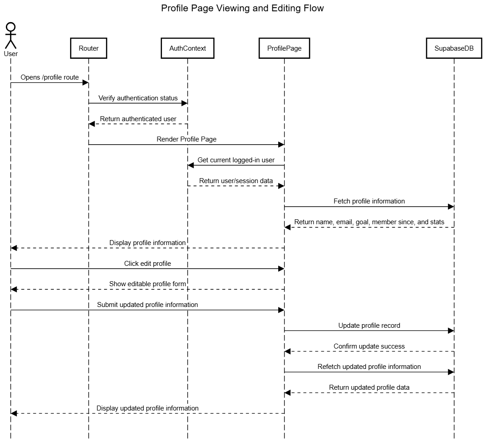

=== Event Trace Diagram for Profile Page Interaction
:author: Ingrid1089

===== Purpose and Relevance
Event trace diagrams are a visual representation of the sequence of events that occur during a specific interaction within a system. They help to understand the flow of actions and the interactions between different components of the system. In the context of the Gym Tracker project, an event trace diagram can be used to illustrate the user interaction with the profile page, which is an important component of the user account management system.

===== Diagram Description
The diagram starts when the user navigates to the Profile Page. The Router checks if the user is authenticated through AuthContext for logged-in status confirmation. Once authenticated, the Profile Page is allowed to Render. Once it loads, it requests the current user/session data from AuthContext. Afterwards, the Profile Page fetches the user’s profile information from SupabaseDB, including name, email, goal, member since, and statistics. Once the requested data is returned, the Profile Page displays the information to the user. As shown in the second part of the diagram, the user is able to interact with the component and start the editing flow. This is triggered if the user clicks the edit option, prompting the ProfilePage to display an editing form. Once the user submits their updated information, the Profile Page sends the updated data to the database, receives a confirmation of the update, and then updates the displayed information accordingly.

Components involved in this interaction include: 

- User: The authenticated user interacting with the profile page. 
- Router: The component responsible for handling navigation and routing within the application. - AuthContext: The context that manages authentication state and provides user session information. 
- Profile Page: The component that displays the user’s profile information and allows for editing. 
- SupabaseDB: The database that stores user profile information and handles data retrieval and updates.

===== Event Trace Diagram

