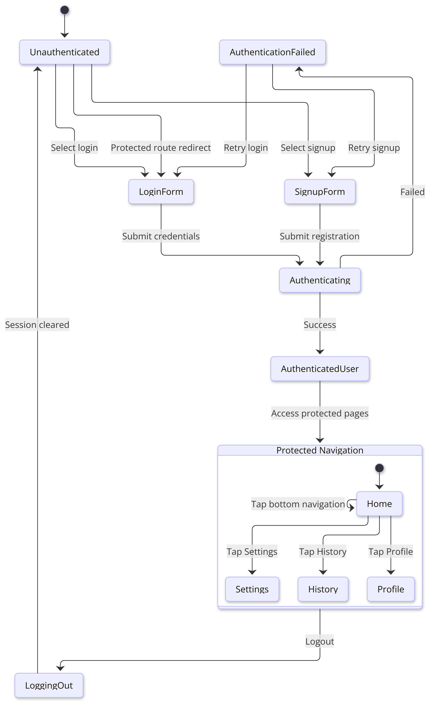

=== State Machine Diagram for Authentication Lifecycle and Protected Navigation
:author: Ingrid1089

===== Purpose and Relevance
State machine diagrams serve as visual representations of the various states and transitions that may occur within a system. In the Gym Tracker project, this state machine models the authentication lifecycle and protected navigation behavior of the application. Modeling this behavior is crucial for understanding how users interact with the system and how authentication determines which pages they can access. Pages such as Home, History, Profile, and Settings should only be accessible to authenticated users, while unauthenticated users should be redirected to the Login page.

===== State Machine Diagram Description
The diagram begins with the user in the unauthenticated state. From this state, the user can choose to log in, sign up, or attempt to access a protected route. If an unauthenticated user tries to access a protected route, the system redirects the user to the login form.

The login and signup forms transition into an authenticating state when the user submits their credentials or sign up information. If the authentication process succeeds, the user becomes authenticated. If the authentication process fails, the system moves to an authentication failed state, where the user can retry the login or signup process.

Once the user is authenticated, the state flows to the protected navigation section of the application. This section includes protected pages such as Home, Profile, History, and Settings. The user can navigate between these pages while remaining authenticated. This aids in representing the protected areas the user can navigate while authenticated.

The diagram also includes the logout transition. When a user logs out, the system moves into the logging out state, clears the active session, and returns the user to the unauthenticated state starting the cycle again.

===== Components of the State Machine Diagram
- Unauthenticated: Represents a user who is not currently logged in.
- Login Form: Represents the state where the user enters login credentials.
- Signup Form: Represents the state where the user creates a new account.
- Authenticating: Represents the process of verifying login or signup information.
- Authentication Failed: Represents an unsuccessful login or signup attempt.
- Authenticated User: Represents a user with a valid active session.
- Home: Represents access to the protected Home page.
- Profile: Represents access to the protected Profile page.
- History: Represents access to the protected History page.
- Settings: Represents access to the protected Settings page.
- Log Out: Represents the process of clearing the user session.

===== State Machine Diagram
