= Exercise Selection – Dataflow Diagram
:author: Luis Marrero
 
== Overview
 
This document describes the Dataflow Diagram (DFD) for the exercise selection flow in the Gym Tracker App. It identifies all external entities, processes, data flows, and data stores involved when a user browses, searches, filters, and orders exercises.
 
*Reference:* Van Lamsweerde – Requirements Specification & Documentation (slide04.pdf)
 
---
 
== External Entities
 
[cols="1,2,3", options="header"]
|===
| ID | Name | Description
 
| EE-01
| User
| Gym member who interacts with the app to browse, search, filter, and order exercises.
|===
 
---
 
== Data Stores
 
[cols="1,2,3", options="header"]
|===
| ID | Name | Description
 
| DS-01
| Exercises table
| Single source of truth for all exercise records. Fields: id (uuid PK), name (text), category (text), created_at (timestamp).
|===
 
---
 
== Processes
 
[cols="1,2,3", options="header"]
|===
| ID | Name | Description
 
| P-01
| Browse exercises
| Returns all available exercises from the exercises table to the user.
 
| P-02
| Search exercises
| Accepts a name query from the user and returns matching exercises from the exercises table.
 
| P-03
| Filter by category
| Accepts a category selection from the user (Strength, Cardio, Flexibility, Mobility) and returns the filtered exercise list.
 
| P-04
| Order exercises
| Accepts an ordering preference from the user (alphabetical, recently added, custom) and returns the sorted exercise list.
|===
 
---
 
== Data Flows
 
[cols="1,2,2,2,3", options="header"]
|===
| ID | From | To | Data | Description
 
| DF-01
| EE-01 User
| P-01 Browse
| browse request
| User requests the full list of exercises.
 
| DF-02
| EE-01 User
| P-02 Search
| search query
| User's name input used to retrieve matching exercises.
 
| DF-03
| EE-01 User
| P-03 Filter
| category filter
| Selected category used to narrow the exercise list.
 
| DF-04
| EE-01 User
| P-04 Order
| order preference
| Chosen ordering method (alphabetical, recently added, or custom).
 
| DF-05
| DS-01 Exercises table
| P-01 Browse
| exercise records
| Full set of exercise records.
 
| DF-06
| DS-01 Exercises table
| P-02 Search
| exercise records
| Full set of exercise records to match against.
 
| DF-07
| DS-01 Exercises table
| P-03 Filter
| exercise records
| Full set of exercise records to filter.
 
| DF-08
| DS-01 Exercises table
| P-04 Order
| exercise records
| Full set of exercise records to sort.
 
| DF-09
| P-01 Browse
| EE-01 User
| exercise results
| Complete unfiltered exercise list returned to the user.
 
| DF-10
| P-02 Search
| EE-01 User
| exercise results
| Name-matched exercises returned to the user.
 
| DF-11
| P-03 Filter
| EE-01 User
| exercise results
| Category-filtered exercises returned to the user.
 
| DF-12
| P-04 Order
| EE-01 User
| exercise results
| Ordered exercise list returned to the user.
|===
 
---
 
== Diagram
 
----

----
 
---