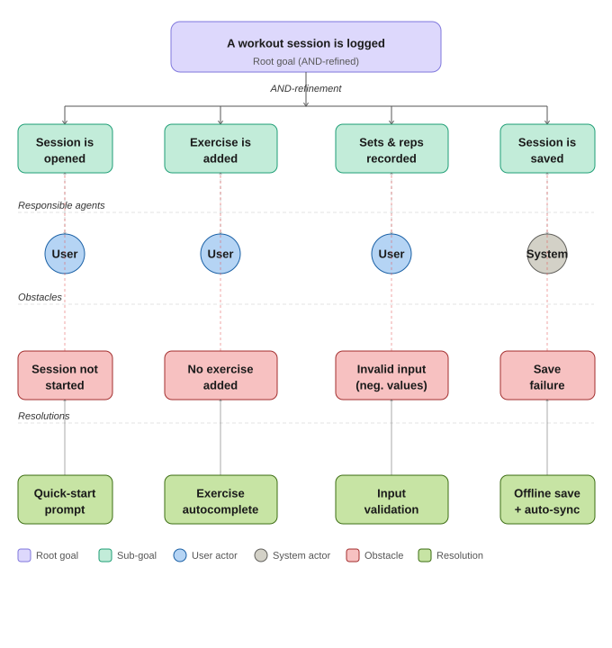

= Gym Tracker — KAOS Goal Diagram
:doctype: article
:toc:
:icons: font

== Goal: A workout session is logged

This document models the AND-decomposition of the root goal
_"A workout session is logged"_ using KAOS-style goal modelling.

=== Diagram

'''

=== Sub-goal breakdown

==== SG-01 — Session is opened

[cols="1,3"]
|===
| *Agent*      | User
| *Obstacle*   | User does not tap "New Session" — app is opened but no session is started
| *Resolution* | Show a quick-start prompt or floating action button on the home screen
|===

==== SG-02 — Exercise is added

[cols="1,3"]
|===
| *Agent*      | User
| *Obstacle*   | User cannot find or add an exercise (empty library, no search)
| *Resolution* | Provide an exercise autocomplete search with muscle-group filters
|===

==== SG-03 — Sets & reps are recorded

[cols="1,3"]
|===
| *Agent*      | User
| *Obstacle*   | User enters invalid data (negative reps, zero weight, missing fields)
| *Resolution* | Enforce input validation with real-time inline error messages
|===

==== SG-04 — Session is saved

[cols="1,3"]
|===
| *Agent*      | System
| *Obstacle*   | Network or storage failure prevents the session from being persisted
| *Resolution* | Save locally first (offline-first), then sync to backend when connection is restored
|===

'''

=== Traceability matrix

[cols="1,2,2,2", options="header"]
|===
| Sub-goal | Functional requirement | User story | Acceptance criterion

| SG-01 Session opened
| FR-01: System must allow users to initiate a new workout session
| As a gym-goer, I want to start a session with one tap
| New session is created with a timestamp on confirmation

| SG-02 Exercise added
| FR-02: System must allow users to search and add exercises
| As a gym-goer, I want to search exercises by name or muscle group
| At least one exercise can be added before saving

| SG-03 Sets & reps recorded
| FR-03: System must accept and validate sets, reps, and weight per exercise
| As a gym-goer, I want to log each set with reps and weight
| Input rejects negative numbers and empty required fields

| SG-04 Session saved
| FR-04: System must persist the session reliably, even offline
| As a gym-goer, I want my session saved even without internet
| Session data appears in history after save; syncs when online
|===